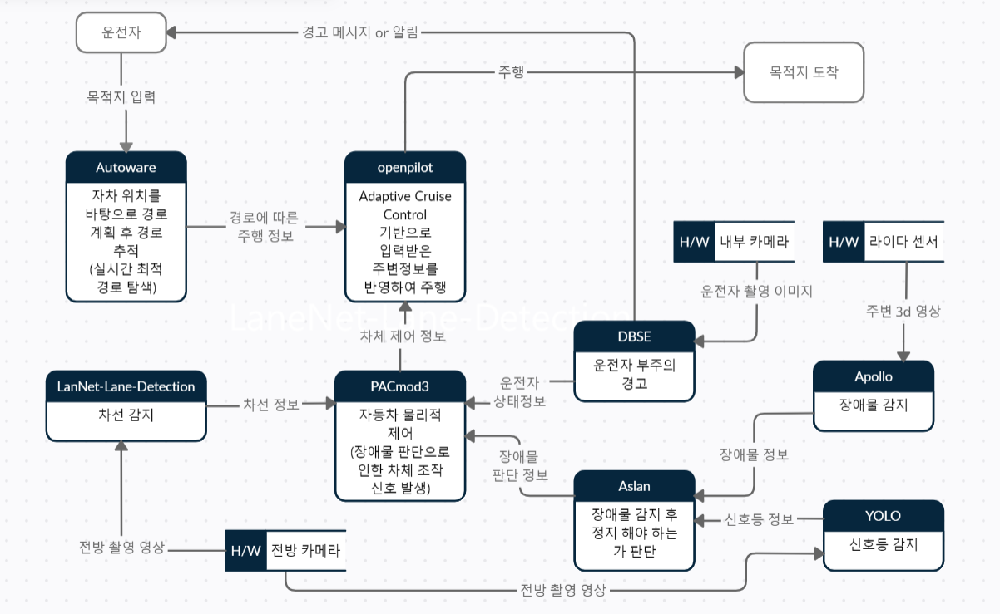

# 13-19팀 시스템 설계도

---

주제 : 자율주행
팀원 : 김현종, 남궁민, 남동진, 남윤호, 최영서, 최유진, 최재완, 최제인
  

## 목차

---

1. 프로젝트 소개
   - 프로젝트 추진 배경
   - 자율주행자동차 설명
   - 우리 프로젝트의 특장점
2. 유사서비스
   - 서빙 로봇
   - CoWa Robot
3. 오픈소스 기술
   - 차선 감지 오픈소스(Lanenet lane detection)
   - 장애물 인지 모듈(apollo)
   - Autoware
   - 비상 정지 신호 (Project Aslan)
   - DBSE-monitor
   - 자동차 물리제어 모듈(PACmod3)
   - 적응식 정속주행 시스템(Openpilot)
   - 객체 감지 알고리즘 모델(YOLO)
4. Data Flow Diagram
   - 설계도
   - 설명
5. License
     

## 1. 프로젝트 소개

---

- 프로젝트 추진 배경

  - 자율주행은 노약자 혹은 장애인, 미숙자들에게 보다 안전한 이동을 보장하여 편리성을 제공한다. 또한 대부분의 사고는 운전자의 실수로 비롯되는데 운전자의 시력, 반응 속도 등을 대신하는 최신 기술로 운전자의 안정성을 보장합니다. 그리고 직접적인 운전이 아니기에 법규 위반 감소에 도움을 준다. 이러한 측면에서 자율주행은 필요한 기술이다.
  - 자율주행 서비스의 세계 시장이 매년 약 36%가 상승하는 것을 보아 앞으로 자율주행자동차 세계 시장 규모는 더욱 성장해 나갈 것이다.
     

- 자율 주행 자동차 설명

  - 자율주행 자동차란 자율주행을 위해 자동차에 IT센서 등 첨단 기술을 융합하여 스스로 주변 환경을 인식, 위험을 판단하고 주행 경로를 계획하여 운전자 또는 승객의 조작 없이 자동차 스스로 안전한 운행이 가능한 자동차를 말한다.

  - 자율 주행의 기본 구조는 인지, 판단, 제어로 나뉜다.
  - 인지에서는 자동차의 센서들이 차량 주변에 대한 데이터를 수집한다. 카메라, 레이더 등과 같은 인지센서와 고정밀 디지털 지도인 HD 맵과 V2X 통신으로 경로를 탐색하고, 지형, 고정지물을 인식하고 변동, 이동 물체를 인식한다.
  - 판단에서는 수집된 데이터를 소프트웨어 알고리즘으로 분석하고 해석한다. 주행 상황을 판단하고 목적지까지의 주행 경로를 설정하고, 돌발상황에 대한 판단과 주행 전략을 결정한다.
  - 제어에서는 판단부에서 취합된 정보들을 바탕으로 차량을 제어하고 조향 조절, 엔진 가감속을 한다.
     

- 우리 프로젝트의 특장점

  - 자율주행 기술은 5단계로 분류할 수 있다. 이 프로젝트는 자율주행 3단계 이상을 추구한다. 3단계는 조건부 자율주행으로 특정 조건의 구간에서 시스템이 주행을 담당하며, 위험시에만 운전자가 개입하는 레벨이다. 3단계부터 주행 제어와 주행 중 변수 감지를 시스템이 담당한다. 데이터 수집 및 라벨링을 하여 신호등을 감지하고 연동을 해주어 시내주행 상황에서도 운동자의 수동 운전은 불필요 하지만 부주의(전방주시태만 등)시 적극적 경고를 해준다.
      

## 2. 유사 서비스 분석

---

- 서빙로봇

  - 도로가 아닌 실내의 자율 주행을 통해 인건비 감소, 안정성의 이점을 가지고 있다. 자신의 위치 파악, 상부 및 하부 라이다(Lidar)를 통해 장애물 감지를 통해 인지-판단-제어라는 자율 주행 자동차와 같은 메커니즘을 가지고 있다.
     

- CoWa Robot
  - 최초 인지한 사용자를 인지하고 초당 20회의 추적을 실시해 사용자의 속도에 맞춰 함께 움직이는 자율주행 캐리어이다. 사용자와 다른 주변 물체에 밀리미터파를 보내고 칩의 알고리즘을 통해 사용자와 물체 거리를 파악한다. 주변 장애물도 이를 통해 회피한다. 사용자에게 편리함을 제공하며 휴대폰으로 원격조작이 가능한 IoT기기이다. 해당 서비스 역시 자율주행의 기본적인 메커니즘인 인지-판단-제어를 따르고 있다.
      

## 3. 사용한 오픈소스

---

**1. Lanenet lane detection(차선 감지) - 최제인**

- 설명

  - tensorflow를 사용하여 IEEE IV 회의 논문 "Towards End-to-End Lane Detection: an Instance Segmentation Approach"를 기반으로 실시간 차선 감지를 위한 심층 신경망을 구현한 오픈소스이다.
  - 가변적인 차선을 처리하고 차선 변경에 대처할 수 있는 실시간 차선 감지 알고리즘이다.
  - 50fps로 실행되기 때문에 기존의 차선 감지 알고리즘보다 빠른 편에 속한다.
  - 최근의 접근 방식은 미리 정의된 고정 된 수의 Ego lane을 감지하는 데 제한되고 차선 변경에 대처할 수 없다. 그러므로 앞서 언급 한 한계를 넘어서 각 레인이 자체 인스턴스를 형성하는 인스턴스 분할로 레인 감지 문제를 처리 한다.
  - 차선을 맞추기 전에 분할 된 차선 인스턴스를 매개 변수해야 한다. 이를 위해 고정 된 "버드아이 뷰" 변환과 달리 이미지에 조건을 둔 학습된 원근 변환을 적용 한다. 이를 통해 도로 평면 변경에 대해 강력한 차선 피팅을 보장한다.
     

- 역할 : 인지

  - 첫번째 단계에서 차선 변경을 처리하고 임의의 수의 차선을 추론할 수 있는 차선 감지 문제를 인스턴스 분할 작업으로 캐스팅한다.
  - 두번째 단계에서 입력 이미지를 받은 네트워크는 도로 평면 변화 (예 : 오르막 / 내리막 경사)에 대해 견고한 차선 맞춤을 허용하는 원근 변환의 매개 변수를 추정한다.
  - 위 두 단계를 통해서 차선 위치가 가장자리인지 아닌지를 분류하고 차선을 인지한다.
     

- 라이선스

  - Apache License Version 2.0
  - [라이선스 고지 사항](https://github.com/MaybeShewill-CV/lanenet-lane-detection/blob/master/LICENSE)
     

**2. apollo(장애물 인지 모듈) - 최재완**

- 설명

  - 라이다, 카메라 및 레이더와 같은 다양한 센서는 차량을 둘러싼 주변 데이터를 수집한다. 센서 융합 기술 인식 알고리즘을 사용하면 도로에 있는 물체의 유형, 위치, 속도 및 방향을 실시간으로 결정할 수 있다.
  - 인지 시스템은 바이두의 빅 데이터와 딥 러닝 기술뿐만 아니라 방대한 실제 운행 데이터에 근거한다. 대규모 딥 러닝 플랫폼과 GPU 클러스터는 대량의 데이터에 대한 학습 시간을 크게 단축한다.
  - 학습이 완료되면 클라우드를 통한 공중파 업데이트를 통해 새로운 모델이 차량에 적용된다.
  - 인공지능과 데이터 중심 솔루션이 결합되어 아폴로의 인지 시스템이 탐지 및 인지 능력을 지속적으로 향상시킬 수 있으며, 이는 다른 자율 시스템 모듈에 정확하고 안정적이며 신뢰할 수 있는 인풋 데이터를 제공한다.
     

- 역할 : 인지

  - 인지 모듈은 여러 카메라, 레이더(전면 및 후면) 및 LiDAR를 사용하여 장애물을 인식하고 개별 트랙을 융합하여 최종 트랙 영상을 얻는 기능을 포함한다. 장애물 하위 모듈은 장애물을 감지, 분류 및 추적한다. 이 하위 모듈은 또한 장애물 움직임 및 위치 정보(예: 방향 및 속도)를 예측한다.
  - 카메라와 레이더, 라이다의 이미지, 영상 데이터를 받아 3D 장애물 트랙으로 출력이 가능하다.
     

- 라이선스

  - Apache License 2.0
  - [라이선스 고지 사항](https://github.com/ApolloAuto/apollo/blob/master/LICENSE)
     

**3. Autoware(경로 탐색 및 추적) - 남윤호**

- 설명

  - Autoware는 3차원 맵과 라이더 센서를 이용한 자차 위치 추정, 라이더 또는 카메라 기반 장애물 탐지, 벡터 맵 기반 경로 계획, 경로 추종 등 자율주행 S/W의 핵심 기능들을 제공한다.
  - Autoware는 20개 이상의 차량 모델들에 이식 되었고, 30개 이상의 국가들, 100개 이상의 회사들에 의해서 폭넓게 사용되고 있다.
  - 현재 Autoware 소스코드는 나고야 대학에서 TIER IV라는 회사를 거쳐 Autoware Foundation이라는 비영리 기관으로 이관해서 관리되고 있다.
  - Autoware는 ROS (Robot Operating System) 1.0 버전 위에서 개발되었으며, 현재 ROS 2.0 버전으로 이식을 준비하고 있다.
     

- 역할 : 판단

  - 자차 위치 추정 기능은 GPS와 라이다 센서를 함께 사용함으로써 센티미터 수준의 정밀도를 제공한다.
  - 장애물 탐지 기능은 객체 탐지와 객체 추적으로 구성된다. 자차 주변에 존재하는 장애물들의 위치와 크기를 파악해야만 뒤에서 설명할 주행 상태 기계가 주행을 위해 계획된 후보 궤적들 중에서 어느 궤적을 선택할지 결정할 수 있다.
  - 경로 계획 기능은 전역적 계획과 지역적 계획으로 나뉜다. 전역적 계획은 벡터 맵, 시작 포즈, 목표 포즈를 입력받아 주행 기준이 되는 기준 경로를 계산한다. 지역적 계획은 기준 경로를 입력받아 기준 경로와 평행한 여러 개의 후보 궤적들을 미리 생성하는 것이다.
  - 경로 추종 기능은 경로 계획 모듈이 제공한 최종 궤적을 작은 시간 단위들로 나누어 차량이 안정적으로 추종하기 위한 타겟 속도와 타겟 조향 각속도를 계산한다.
     

- 라이선스

  - Apache License 2.0
  - [라이선스 고지사항](https://github.com/autowarefoundation/autoware/blob/main/LICENSE)
     

**4. Aslan(비상 정지 신호) - 김현종**

- 설명

  - 로봇 운영체제(ROS) 프레임 워크 기반 오프소스이며 Gazebo(물체 회피 및 컴퓨터 비전 테스트에 적합한 3D 시뮬레이션 환경)이 내장되어 있다
  - Ubuntu와 ROS Melodic 사용환경이 갖춰져야 사용 가능하며 비상정지 신호 외에도 여러 개선사항에 대해 연구 개발이 진행 중이다.
  - Aslan의 비상정지 신호는 지정 경로 주행 중 실행된다. 자동 주행 차량이 지정된 경로로 주행 중에는 항상 차량의 모션 카메라로 주변의 장애물을 탐지하며 장애물 감지 소프트웨어와 연계하여 장애물과의 거리가 빠르게 좁혀지거나 갑작스러운 장애물의 출현을 통해 반응하도록 설계되어 있다.
  - 비상 정지 신호 기능은 해당 기능이 동작할 경우 즉각적으로 차량 관제 시스템에 메시지를 보내 속력을 32.4 km/h로 제한되도록 한다.
     

- 역할 : 판단

  - 인지부에서 전달받게되는 정보(장애물 정보, 신호등 정보 등)를 분석하여 정지신호를 제어부에 보낼 지 판단 하게된다.
  - 전달되어지는 정보는 매우 빠른 속도록 계산에 들어가며 본 오픈소스는 이용자의 안전을 위한 안정성 향상을 최우선으로 생각해 빠른 정지신호를 발생하도록 한다.
     

- 라이선스

  - Apache License 2.0
  - [라이선스 고지사항](https://github.com/project-aslan/Aslan/blob/melodic/LICENSE)
     

**5. DBSE-monitor(운전자 부주의 경고) - 최유진**

- 설명

  - DBSE-monitor는 운전 중에 졸려서 졸음운전을 하거나 딴짓을 하며 전방주시를 하지 않을 때 경고해주는 시스템이다.
  - DBSE-monitor는 졸음 감지, 감정 감지, 드라이빙 모니터 모듈로 구성되어 있다.
     

- 역할 : 인지

  - Jetson Nano를 이용하여 카메라를 통해 운전자의 상태를 파악하고 졸거나 운전에 집중하지 못하고 산만한 상태일 때 시각 또는 청각 신호를 통해 운전자에게 알리는 기능을 제공한다.
  - 졸음 및 감정 감지 모듈은 운전자의 얼굴 인식을 위해 OpenCV의 Haar Cascades방식을 사용한다.
  - 시스템이 운전자의 얼굴을 감지하면 모듈은 Jetson Nano에서 실행되는 PyTorch 기반 신경망을 통해 운전자의 눈 상태와 감정 상태를 인지한다.
     

- 라이선스

  - MIT License
  - [라이선스 고지 사항](https://github.com/altaga/DBSE-monitor/blob/master/LICENSE)
     

**6. PACmod3(자동차 물리제어 모듈) - 남동진**

- 설명

  - 전통적인 자동차는 페달, 핸들 등의 유압장치를 토대로 운행한다. 자율주행을 실현하기 위해서는 유압장치가 아닌, 전기 장치를 통해 자동차를 운행 할 수 있어야한다.이것을 drive-by-wire 기술이라고 한다.PACmod3는 이를 drive-by-wire를 실현시키는 오픈소스이다.
  - PACmod3는 자동차의 각 하드웨어 제어를 위한 함수들로 이루어져있다. 예시로 브레이크의 작동을 원한다면, brake_motor_rpt_1, brake_motor_rpt_2 등의 함수가 실행되며, 엑셀의 작동을 원한다면 steering_motor_rpt_1, steering_motor_rpt_2 등의 함수가 실행된다. 함수는 엑셀, 브레이크 뿐아니라 문, 와이퍼, 크락션 등 자동차 하드웨어 대부분에 걸쳐 존재한다. 이를 통해 자율주행을 위한 모든 하드웨어를 제어 할 수 있다.
     

- 역할 : 제어

  - PACmod3는 제어를 위한 모듈이다. DBSE, Aslan 등 인지 모듈을 통해 현재 자동차를 급속으로 정지시켜야 할 비상상황인 경우, 그것에 대한 정보를 받고 수행하는 것이 그 역할이다.
  - 전기 신호를 이용하여 하드웨어에 명령을 내리므로, 전통적인 유압장치를 통한 제어보다 빠르게 자동차를 제어할 수 있다.
     

- 라이선스

  - MIT license
  - [라이선스 고지사항](https://github.com/astuff/pacmod3/blob/ros1_master/LICENSE)
     

**7. Openpilot(적응식 정속주행 시스템) - 남궁민**

- 설명

  - OpenPilot은 콤마에이아이의 인공신경망 기반 ADAS 소프트웨어이다.
  - OpenPilot 전용 운영체제OS가 설치된 스마트폰 등을 이용해 전방을 주행하는 자동차와 그 자동차의 주행 속도를 감지한다.
  - 하드웨어 장치(레이더 정보 전송, 가감속 제어 장치)를 이용해 주행하고 있는 전방의 차량과 뒤따라 주행하는 차량이 적정 거리를 유지하며 주행하도록 돕는다.
  - OpenPilot은 차량의 CAN 네트워크에 연결하여 작동한다.
     

- 역할 : 판단

  - OpenPilot은 주행속도 및 차간거리를 판단하여 경로에 따른 주행정보와 차체 제어 정보를 받아 도착지까지 주행하는 역할을 한다.
  - 도로 상황을 이해하고 주행장소를 예측하는 뉴럴 네트워크가 포함되어 차선이 희미해진 지역이나 다른 국가를 주행하는 등의 상황에서도 문제 없이 판단 및 주행이 가능하다.
     

- 라이선스

  - MIT License
  - [라이선스 고지사항](https://github.com/commaai/openpilot/blob/master/LICENSE)
     

**8. YOLO(객체 감지 알고리즘 모델) - 최영서**

- 설명

  - 이미지에서 관심 객체를 배경과 구분해 식별하는 자동화 기법이다.
  - 올바른 객체 탐지를 위해 경계 박스를 설정해 객체의 상태를 나타내는 사물의 카테고리와 연관시킨다.
  - 네트워크의 최종 출력단에서 경계박스의 위치 찾기와 클래스 분류가 동시에 이루어진다.
  - 목표물의 식별 능력이 강하고 정밀도가 높으며 처리 속도가 빠르다.
  - 데이터 수집 대상을 설정하여 이미지 집합을 훈련하고 테스트 하기 때문에 움직이는 영상에서의 목표물의 정확도가 높다.
     

- 역할: 인지

  - 주어진 이미지를 한번의 스캔으로 객체의 특징과 경계선을 계산한다.
  - YOLO네트워크를 사용하여 신호등을 감지하고 분류하고 신호등 인식을 위해 네트워크 결과를 조정하여 신호등 정보를 인식한다.
     

- 라이선스
  - GNU General Public License v3.0
  - [라이선스 고지사항](https://github.com/ultralytics/yolov5/blob/master/LICENSE)
      

## 4. Data Flow Diagram

---

- 설계도
  
   

- 설명
  - 운전자가 Autoware에 목적지 입력한다.
  - Autoware에서 최적의 길을 탐색 후 경로 및 주행정보를 openpilot에 전달한다.
  - openpilot에서 주행 정보에 따라 주행한다.
  - 주행 중 Lidar로 촬영된 영상을 Apollo에서 판독하여 주변 장애물 정보를 Aslan에 전달한다.
  - 주행 중 전방 촬영 영상을 YOLO에서 판독하여 신호등 감지 후 Aslan으로 신호등 정보를 전달한다.
  - Aslan에서 장애물 및 신호등 정보를 해석해서 정지 여부 판단 결과를 PACmod3로 전달한다.
  - 주행 중 전방 촬영 영상을 Lanenet lane detection에서 판독하여 차선 감지 후 차선 정보를 PACmod3로 전달한다.
  - PACmod3에서 전달 받은 정보를 바탕으로 차체의 물리적 제어를 판단하고 그 신호를 openpilot으로 전달한다.
  - openpilot에서 전달 받은 신호에따라 가감속 및 조향한다. -일련의 과정을 반복하여 목적지 도착한다.
      

## 5. License

---

|     | 
사용한 오픈소스
 | 
라이선스
       |
| :-: | :------------------------------- | :------------------------------ |
|  1  | Lanenet lane detection           | Apache License 2.0              |
|  2  | apollo                           | Apache License 2.0              |
|  3  | Autoware                         | Apache License 2.0              |
|  4  | Aslan                            | Apachi License 2.0              |
|  5  | DBSE-monitor                     | MIT License                     |
|  6  | PACmod3                          | MIT license                     |
|  7  | Openpilot                        | MIT License                     |
|  8  | YOLO                             | GNU General Public License v3.0 |

 

- GPL 3.0 라이선스는 Apache 2.0과 MIT 라이선스와 충돌하지 않는다.
  참고 : https://www.osadl.org/fileadmin/checklists/unreflicenses/GPL-3.0-only.txt
   

- GPL v3.0 라이선스의 파생저작물에 대해서도 GPL v3.0을 적용하여 소스 코드를 공개할 것을 요구하는 소스 코드 제공 의무 사항에 따라 본 프로젝트의 최종 라이선스는 **GNU General Public License v3.0** 라이선스를 적용한다.
    
